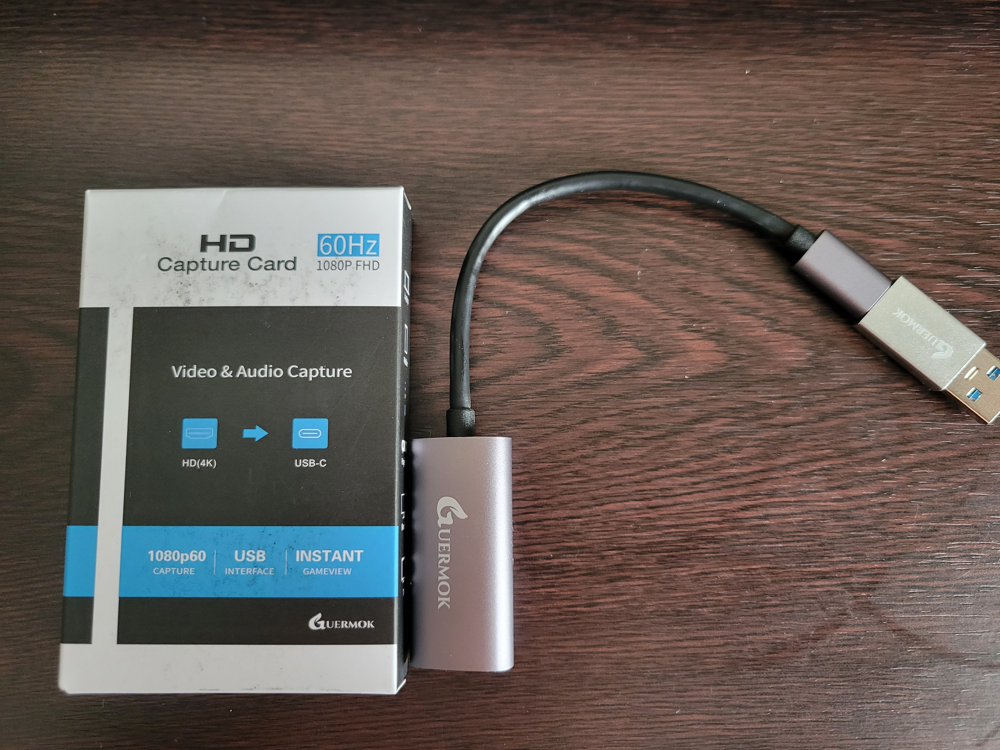
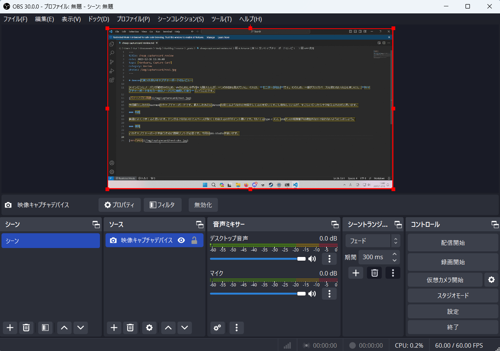
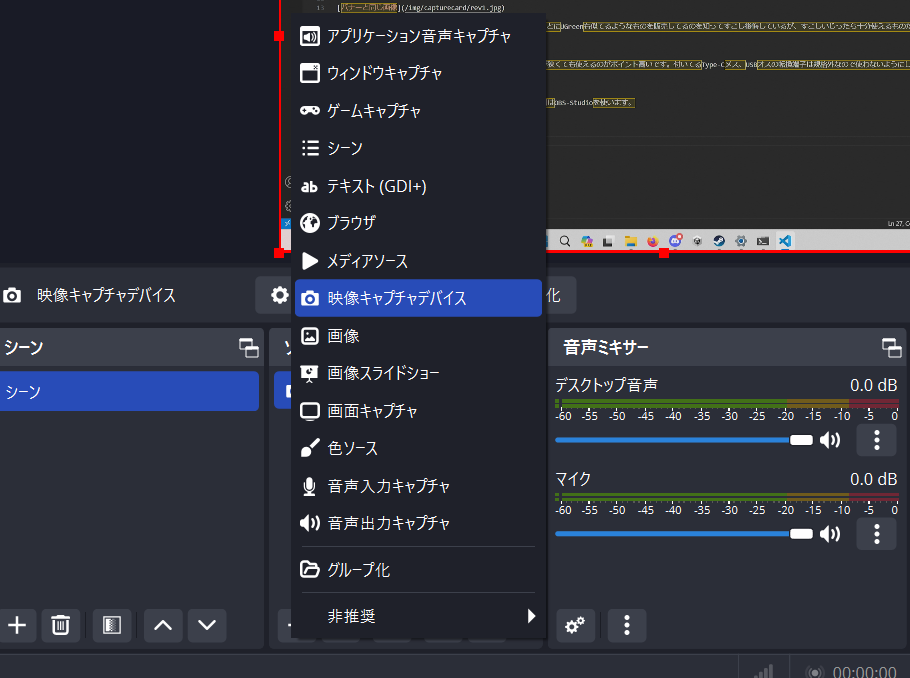
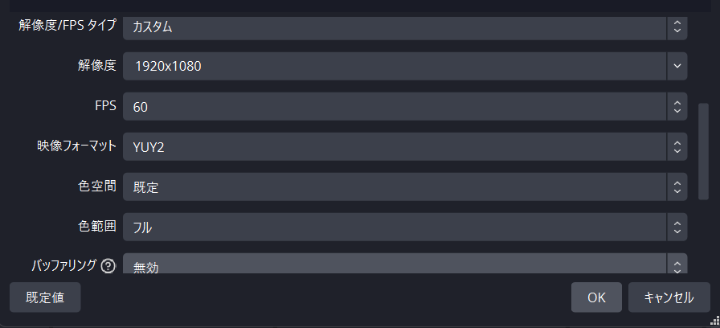
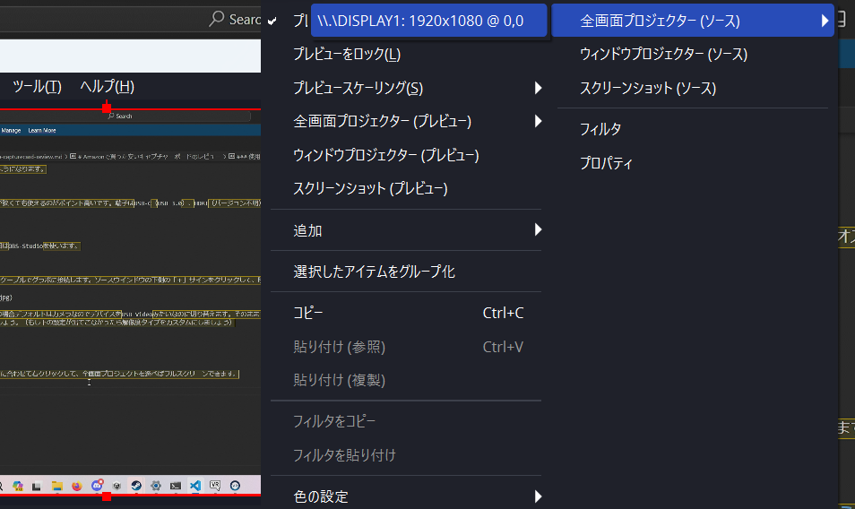
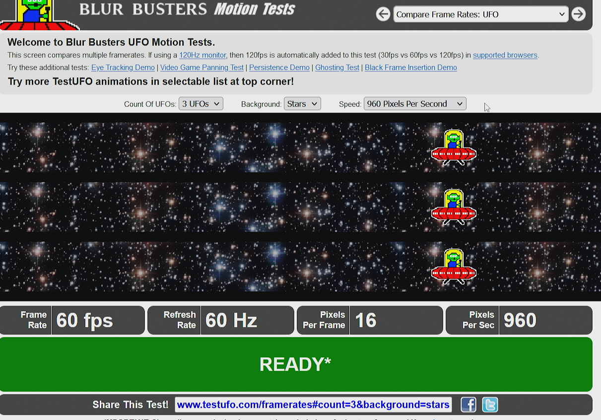

メインだったノーパソが修理中のため、VRのために中古のPCを購入したが、一つの問題を抱えていた。それは、**モニターがない**です。そのため、一番デスクスペースを使わない方法を見つけた：**キャプチャーボードをもう一台のノーパソに接続して使う**ということです。

:::note
ディスプレイとなるノートパソコンやタブレットが必要です。
:::

今回購入したのはGuermokのキャプチャーボードです。レビューの時にUGreenも似てるようなものを販売してるのが分かってすこし後悔しているが、すこしいじったら十分使えるものだと思います。

:::warning
そのままではラグがひどくて使えません！いじったら普通に使えるようになります。

一部のグラボはキャプチャーボードを認識せず、性能を出せなくなります。
:::
### 外観

普通によくできてると思います。ドングルではないのでスペースが狭くても使えるのがポイント高いです。端子はUSB-C（USB 3.0）、HDMI（バージョン不明）です。付いてるType-Cメス、USBオスの転換端子は規格外なので使わないようにしましょう。

### 取り付け

このキャプチャーボードを使うために録画ソフトが必要です。今回はOBS-Studioを使います。

キャプチャーボードのC端子をノーパソに取り付けて、HDMI端子をケーブルでグラボに接続します。ソースウインドウの下側の「＋」サインをクリックして、映像キャプチャーデバイスを追加します。

新規作成を選び、このウインドウにたどり着きますが、ノーパソの場合デフォルトはカメラなのでデバイスをUSB Videoみたいなのに切り替えます。そのままでも使えますが、**この世にないようなラグいディスプレイができてしまいます**ので設定を下のように変えましょう。（もし下の設定が出てこなかったら解像度タイプをカスタムにしましょう）

:::note
色範囲をフルにすると色が少しだけ良くなる
:::

「OK」をクリックしてソースを追加します。カーソルをOBSの画面に合わせて右クリックして、全画面プロジェクトを選べばフルスクリーンできます。

これで全画面のディスプレイが使えるようになります。

### 検証/感想

4Kモードは基本的に使えないほどラグいのでおすすめしません（そもそも2000円台ではできるはずもない）。ただ今回パソコンのディスプレイがFHDなのでラグいこと以外では検証できませんでした。

本文の設定では、問題なく60Hzの表示ができます。(動画ではないので見づらくてすみません)

マウスは0.1秒以下の遅延がありますので、FPSゲームなどには不向きですが、FFなどペースがそれほど速くないゲームはSteam Linkの感覚で遊べると思います。

もしデスクのスペースがないなど、モニターをお持ちでない場合では、モニターの代用品としてキャプチャーボードを使ってもいいと思います。