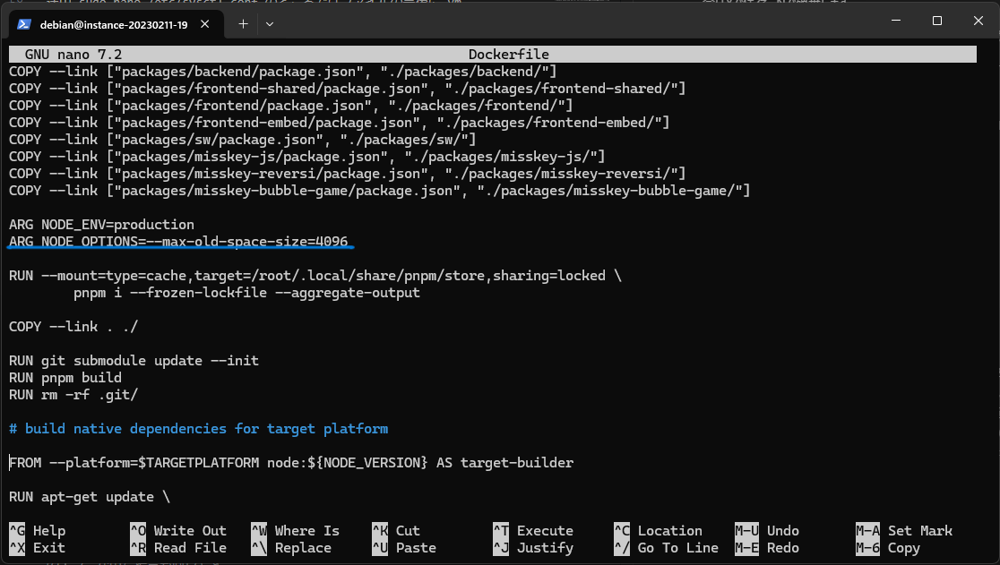

:::note[更新]
2025年03月20日
:::

> Misskeyでポストしたものをまとめた記事です。

1GBメモリのサーバーでMisskeyを建てたので大まかな手順をご紹介します。（Docker方式）

必要なもの: Linuxサーバー (バーチャルマシン/VPS)、ドメイン
 

## 事前準備

### Linuxサーバー

ホスティングサービス:

今回はOracle社のOCI無料AMD鯖を使います。

スペック:

- 1/8 AMD OCPU
- 1GB Mem
- 50GB Boot Volume
- 10TB データ

OCIのARM無料マシンは存在しないと思ったほうがいいかもしれません。(本当に欲しければマシン確保スクリプトの利用をおすすめします)

メモリ1GBはもちろんMisskeyには足りません。このあと対策法をご紹介します。

ちなみにオンラインのサーバーは本当に毎日不審なログイン試行が発生しますので、ログインはPublic Key方式をおすすめします。

私はDebian11を使いましたが、Ubuntu22の手順はほぼ同じです。OCIではDebianのプリセットがないのでUbuntuにした方がいいでしょう。
 

### ファイヤーウォールを設定します

サーバーのコマンドラインに接続してファイヤーウォールを設定します。

VultrなどのサービスではUFWを設定します。

OCI、GCP、AWS、Azureなどの大手会社のサービスでは独自のファイヤーウォールがあります。各自のドキュメントをしたがって22、80、443ポートを開放してください。
 

### SWAPを追加します

1GBメモリはビルドの時に足りなくなるため、SWAPの追加が必要です。

Debian11向けのものですがUbuntuの手順は同じです。

ガイド：

[DigitalOcean(英語)](https://www.digitalocean.com/community/tutorials/how-to-add-swap-space-on-debian-11)

英語読めなくても $ のコメントを入力するだけで行けると思います。

ただし、ls -lh /swapfile の後の -rw-r--r-- 1 root root 1.0G Aug 23 11:14 /swapfile はスルーしてください。これはコマンドではにゃくアウトプットです。

途中 sudo nano /etc/sysctl.conf のところではファイルの最後に vm.swappiness=10 と vm.vfs_cache_pressure=50 を追加して ctrl + x で終了します。Save modified buffer が出た場合はYで保存、Nで破棄します。

SWAPの容量を2GB以上にしてください。（私は4GBにしました。）

分からなくてもその中の1Gを2G以上に書き換えて、$が付いているところをすべて入力してもできると思います。
 

## Misskeyセットアップ

### Misskeyの公式ドキュメントにしたがって docker compose build の前までセットアップします

[Misskey-hub公式ドキュメント](https://misskey-hub.net/ja/docs/for-admin/install/guides/docker/)

早速ドメインが聞かれるので、決めておいたほうがいいでしょう。

ちなみにApex Domainを利用する場合ではセットアップ方法が違う場合があります。

今回はお一人様向けというわけで、わざわざMisskeyだけのために新しいドメインを取得する人がいないでしょう...

:::caution
以前Misskeyで使ったことあるサブドメインの再利用や、一度起動したことあるMisskeyのドメインの変更はおやめください。
:::

### Dockerfilesを編集します

sudo nano ./Dockerfile でDockerfileを編集します。

最も上のARG NODE_ENV=productionの下に

ARG NODE_OPTIONS=--max-old-space-size=4096

を追加します。

（4096をこの前に設定したSWAPの数値x1024に書き換えてください。）

DockerfileはMisskeyの更新によって変わったりしますが、入れたコードが画像の中にある RUN pnpm buildの上にあることを確認できればOKだと思います。
 

### 続けてビルドと初期化を行います

最新バージョンでは1時間以上かかると思います。(1/8 OCPUは遅い)

(まだ起動しないでください。)
 

### Nginxとcertbotをセットアップします(ドメインからアクセスするために)

まずはNginxをインストールします

sudo apt-get install nginx

apt-getを使っている人が多いのでここでapt-getを使いましたがaptもほぼ同じです。

Certbotをインストールします。

CertbotはSSL証明書を自動的に発行、更新するためのツールです。SSL証明書は有料のものもありますがCertbotのものは無料です。

[ガイド(英語)](https://certbot.eff.org/)

下の My HTTP website is running Software ではNginxを選択し、System ではUbuntuかDebian(linux(snap))を選択します。

始める前にDNSでドメインのレコードを設定します。

> これは何なのかわからないとちょっと解説が難しいですが、レコードはホームページの英語のアドレスがどこのサーバー(IPアドレス)に指しているのかを記録するものです。

ここのドメインは、Misskeyセットアップするときにセットアップしたものです。

セットアップ方法はDNSによって違いますのでここでは省略します。

Misskeyは公式のNginx設定ガイドがありますのでcertbotのステップ6では下のsudo certbot certonly --nginxを使います。

認証のためメールアドレスが聞かれますので専用のメールアドレスを作っておいた方が良いでしょう。 

最後はドメインを入力します。エラーが出た場合のほとんどはファイヤーウォールのせいなので、ファイヤーウォールの設定をご確認ください。

終わりましたら Misskey-hub のドキュメントに従ってNginxのセットアップを行ってください。

[ドキュメント](https://misskey-hub.net/ja/docs/for-admin/install/resources/nginx/)

その中のexample.tldは4箇所あります。
 

### Cloudflareをセットアップします（推奨）

### 起動します

502 Bad Gateway が出た場合は数分間空けてctrl+F5でリフレッシュしてください。Misskeyのエラーが出た場合も同じです。
 

### Adminアカウントを作ります

もしユーザートークンに関するエラーが出た場合、設定画面でログアウトしたらセットアップ画面が表示されます。これで終わりです。
 

### アップデートを行うときには

:::warning
たまにデータベースのマイグレーションが必要になります。
更新するときに必ずUpdate Logを読んでください。
:::

[Misskey-hub公式ドキュメント](https://misskey-hub.net/ja/docs/for-admin/install/guides/docker/)

ちなみに今回のようにドライブが50GBしかないときにはDockerのBuild Cacheを消すことをおすすめします。
 

### 辞めたいときに

サーバーを利用しなくなったときには Nginx の設定で410を返すようにしましょう。連合などからサーバーの故障と間違わないようにするためです。
 

## 最後に

あんまり需要がないと思いますが、もし参考になったら幸いです。