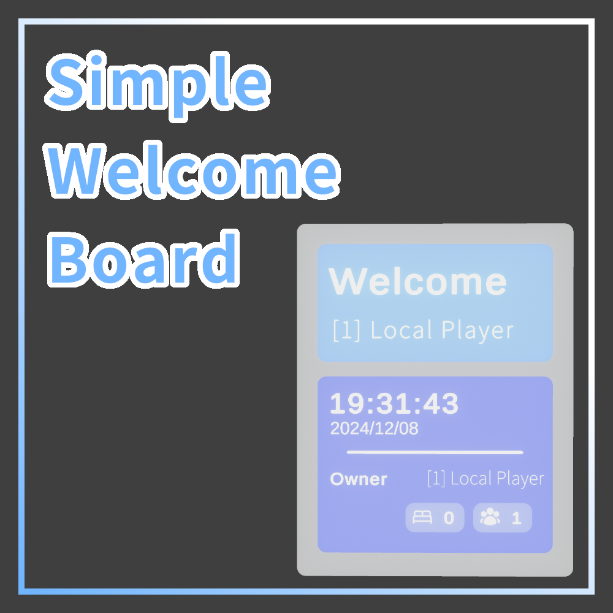
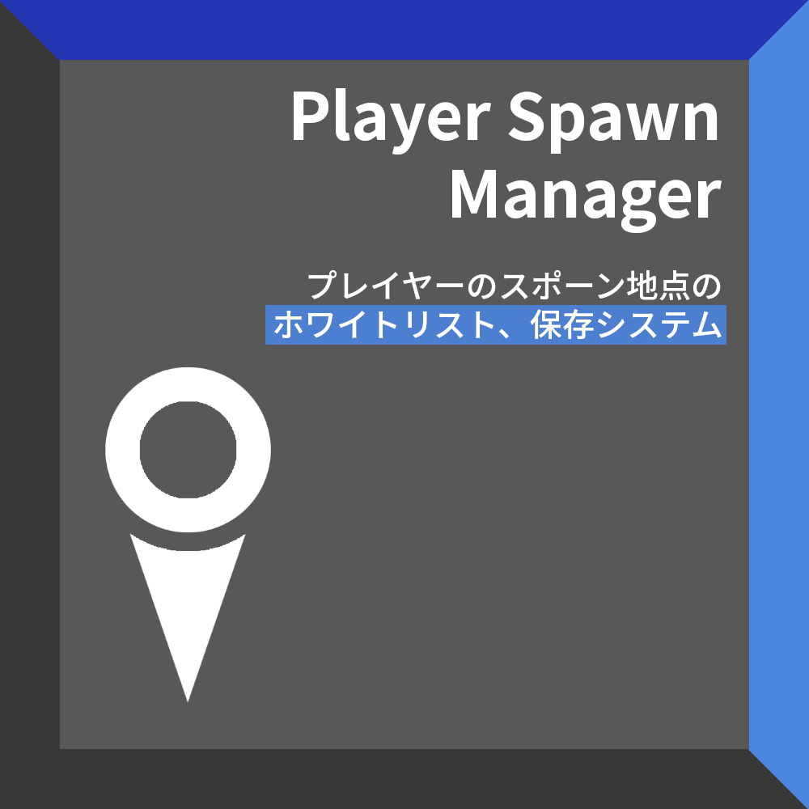
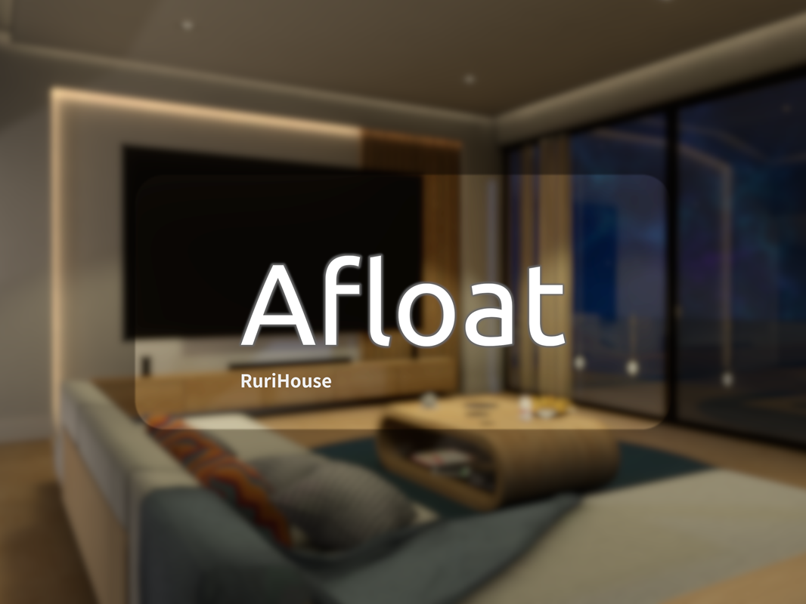
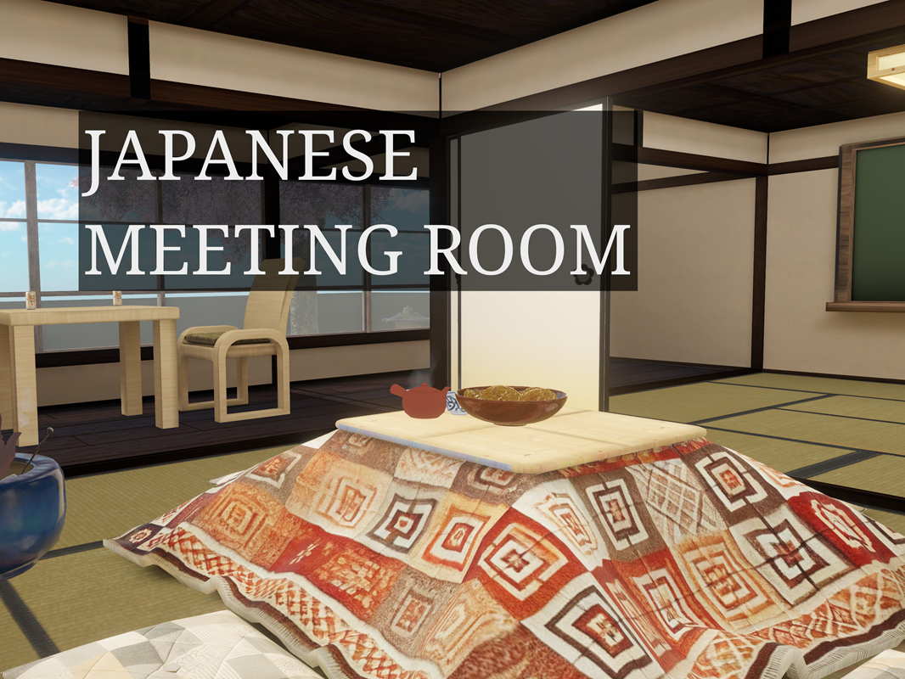
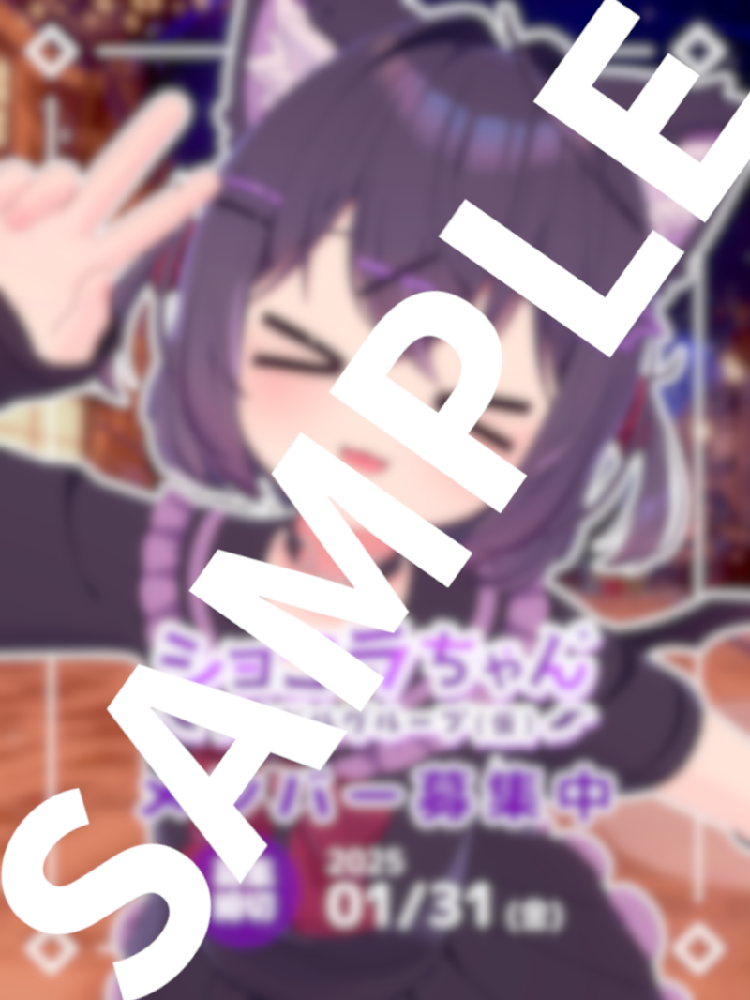
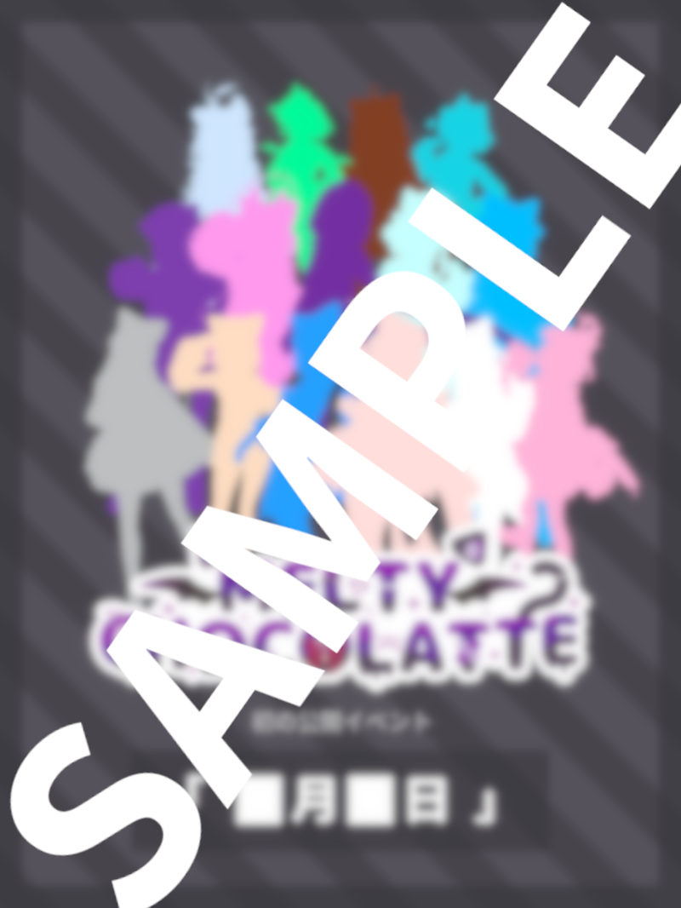
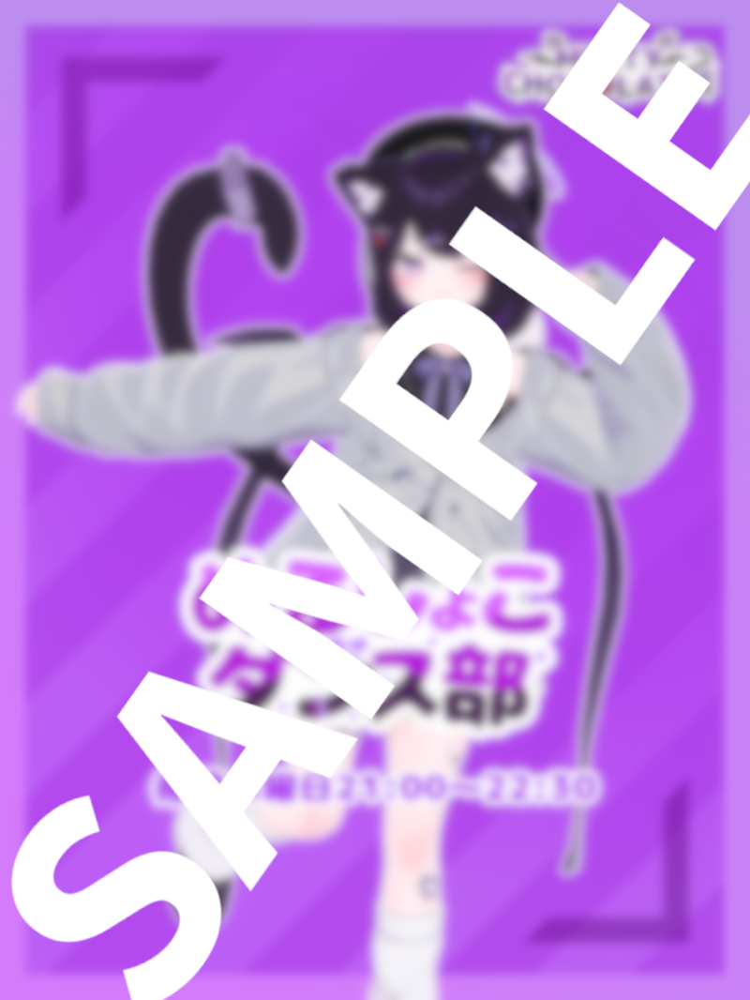
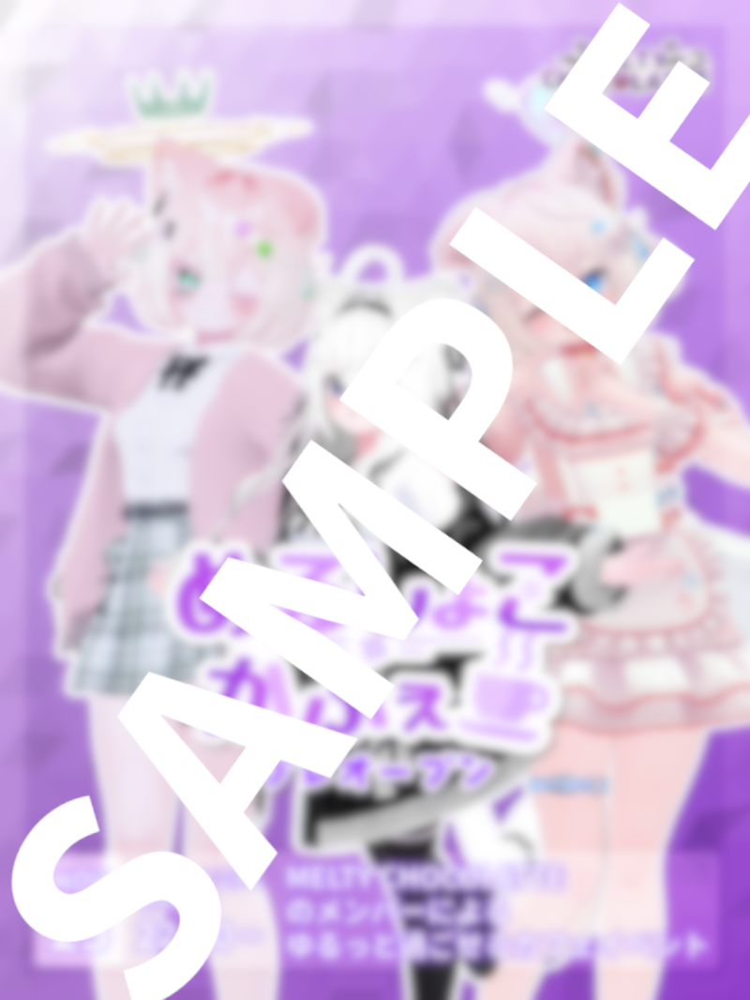

:::note[更新]
2026年2月7日
:::

## 個人プロジェクト

### ワールドギミック

#### Booth で公開中のギミック

Booth ページ: https://saphir.booth.pm/

##### Simple Welcome Board

ワールドの入り口などのための看板ギミックです。

インスタンスオーナーや、プレイヤー人数の情報が表示されます。

有料プランでは、特定のエリアにいる人数もわかります。
 

##### Simple Item Lock

アイテム用ホワイトリスト、パスワードシステムです。

インスタンスオーナーの許可など、フレキシブルな設定ができます。

有料プランでは、インスタンスの中でパスワードを作成する機能も備わっています。
 

##### Player Spawn Manager

プレイヤーのスポーン地点を変更したり、保存したりするギミックです。

ホワイトリストも利用できます。

有料プランでは、インスタンスの中で設定を確認できるコントロールパネルが同封されています。
  

#### Githubで公開中のギミック

Github ページ: https://github.com/TamakiRuri?tab=repositories

##### Simple Megaphone

ワールド用メガホンギミックです。

メガホン本体がありませんが、アイテムにアタッチすれば使えるはずです。
 

##### Waffle Waffle

ランダムの音を出すギミックです。（れんちょんワッフルのパロディギミックです）

Audio Clipごとに音量を調整することができます。
 

##### World Misc Gimmicks

ChangeSkyBox シェーダーによるスカイボックスを変更するギミックです。

InteractToChangeAvatar 触れると特定のアバターに変更させるためのギミックです。

ReverseItem アイテムを動的に逆転させる(スケール-1)ためのギミックです。

StageTeleporter は1~2人を特定の場所にテレポートさせるためのギミックです。

LightBarColorManager Emissionの色を滑らかに変更させるためのギミックです。

LightIntensityChanger Emissionの強さを滑らかに変更させるためのギミックです。
  

### その他 Github にあるもの

##### KawaiiSuwari-MA

可愛いお座りツールをMAに対応させるためのプレハブです。

（ギミック本体は含まれません）
 

##### daizu-tts

Voicevoxを利用したDiscord用読み上げボットです。
  

### ワールド

#### RuriHouse Afloat

現代風のおしゃれな家です。

現在主に利用しているホームワールドになります。ワールド改変としては変更点が少ないが、デザイン要素が好きです。

https://vrchat.com/home/world/wrld_1888e25d-e401-4bd1-a338-6794126bd227/info
 

#### るりはうす - RuriHouse

現代風のガラス張りの家です。

Blenderでワールドレイアウトを大きく変更したワールドになります。（面積を60%削減しました）

https://vrchat.com/home/world/wrld_c13da56e-0017-4df8-9029-13cd59ae3ab8/info
 

その他のワールドはVRChatのプロフより確認できます。

https://vrchat.com/home/user/usr_f1f901de-fba0-4e1f-bce0-353165037cc7
  

### その他デザイン

ワールドサムネ、ギミック紹介写真などはすべてRuriSapphireのオリジナルデザインとなります。（フォントはアセットを利用しています）
  

## グループプロジェクト

### ワールド

#### MELTY CHOCOLATTE用ワールド

リスト:

 - メンバー発表会ワールド
 - ダンス部ワールド
 - カフェイベントワールド

MELTY CHOCOLATTE用ワールドはすべてプライベートになっております。

ご見学はMELTY CHOCOLATTEが主催するイベントに参加するか、RuriSapphireにDMで予約してください。（ご契約のご相談以外の見学は、承らない場合がございます）
 

#### Japanese Meeting Room

UT-virtual 8期生によるグループ開発で作成したワールドです。

和室x会議というコンセプトで、和風な会議室です。

クレジットなどはワールド内にあります。
 

https://vrchat.com/home/world/wrld_e6515a8a-3d62-4ada-889e-5b0914e2a637/info

#### TestStage

2025年東京大学五月祭のUT-virtual出展のために作成したダンス録画用ワールドです。

ご見学はRuriSapphireにDMで予約してください。（ご契約のご相談以外の見学は、承らない場合がございます）
  

### デザイン

#### MELTY CHOCOLATTE 募集用ポスターおよびロゴ

写真: だーじりんてぃー

 

#### MELTY CHOCOLATTE メンバー発表会ティーザー

シルエット: 0、1期生全員

MELTY CHOCOLATTEのロゴはMELTY CHOCOLATTEが所有しています。

 

#### MELTY CHOCOLATTE ダンス部ポスターおよびロゴ

写真: 幸乃ととめ

MELTY CHOCOLATTEのロゴはMELTY CHOCOLATTEが所有しています。

 

#### MELTY CHOCOLATTE カフェポスターおよびロゴ

写真: 74mochi, Lize_Lily, らいちちゃん

MELTY CHOCOLATTEのロゴはMELTY CHOCOLATTEが所有しています。

 
