:::note[更新]
2026年1月18日
:::

## General

### レンダリング・ライティング

##### **アバターの衣装の明るさが違う**

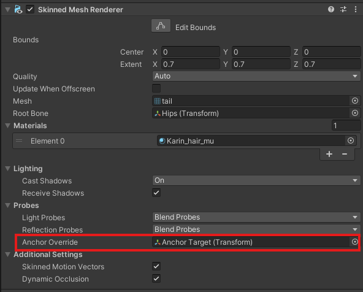

:::tip
MAのセットアップでは自動設定されるようになりました。
:::

Avatar の Skinned Mesh Renderer (SMR) に Anchor Override という欄があります。

通常、アバターのオリジナルパーツではすでに何かが入っていますが、衣装ではnoneになっているときが多いです。

アバターのオリジナルパーツと同じのObject入れると完成です。

キメラアバターなども、すべてのSMRに同じAnchor Overrideが入っているように気おつけましょう。

##### **アバターが白ではないライティング環境で変な色になる**

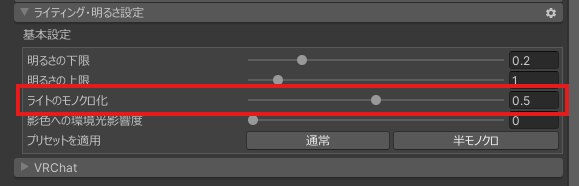

> liltoon のみ動作します

ワールドColor Gradingによって色が変わる場合もありますが、今回紹介するのはライティングの場合です。

liltoonを利用する場合、ライティング設定の中に「ライティングモノクロ化」という選択肢があります。

もしその値が0になっている場合、0.3~1に設定すると受ける影響が減ります。（通常では0.5以下が好ましいです）

##### **アバターがライティングが暗いときに真っ黒になる**

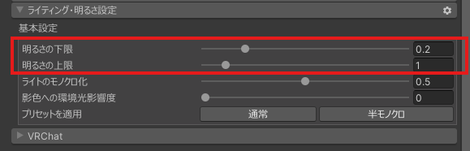

シェーダーによってライティング設定で明るさ下限を設定することができます。

liltoonではライティング設定で明るさ下限を0.1以上にすると、アバターのライティングが改善されます。

もちろん、ライトリミットを変更するギミックもおすすめです。

##### **アバターの衣装が一定の角度で見ると消える**

:::tip
MAのセットアップでは自動設定されるようになりました。
:::

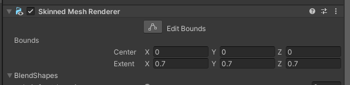

Boundsが正しく設定されていない可能性があります。Boundsとは、衣装などがレンダリングされる範囲のことです（白い線で囲まれます）。もしここの範囲を見ていないという判定になったら、モデルがレンダリングされなくなります。Skinned Mesh Renderer (SMR)のBoundsのExtentを全部大きくする（ここでは0.7）と修正されます。

場合によって、0.7で大きすぎたり小さすぎたりすることがあります。Extentのx, y, z全て白い箱線がアバターの高さより長くなるような数値にすることがポイントです。

## FX・アニメーション

##### **ジャンプして着地した瞬間動きがおかしくなる**

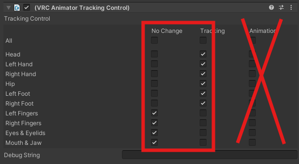

:::tip
カスタムLocomotion（一部お座りモーションも含め）をご利用の場合では干渉する可能性があります
:::

アバターの Base (Locomotion) AnimatorレイヤーのLocomotionレイヤーにある「JumpAndFall」をダブルクリップしたら、SmallHopなどのアニメーションがあると思います。（Baseレイヤーがない方は公式からコピペするか、お座りツールのプレハブにあるものをコピペしてから編集してください）

それらをクリックするとAnimator Tracking Controlというコンポーネントがあると思いますので、それを消すか、AnimationにあるチェックをすべてTrackingまたはNo Changeに変えるといいです。

ただし、ごろ寝ツールなどでMA対応のプレハブをご利用の場合は、プレハブの中のLocomotionレイヤーもコピペして同じ作業をする必要があります。

（コピペしてから編集する場合では、プレハブのAnimatorの変え忘れをご注意ください）

#### **デスクトップで腕が不自然に動く**

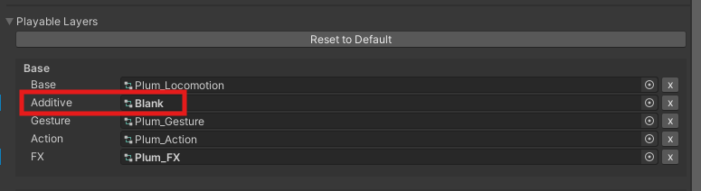

:::tip
呼吸アニメーションなど、Additive(Idle)レイヤーを利用するギミックを利用する場合でも一回試してみてもいいと思います
:::

これはアバターのAdditive (Idle)レイヤーのデフォルトのアニメーションによる動きです。

もし気になるのであれば、新しいアニメーターファイルを作成し、なにも変更しないままデフォルトのアニメーターを置き換えることがおすすめです。

もしアバターにアバター専用のAdditiveが入っている場合（かつ、SDKで提供されたデフォルトアニメーターじゃない場合）では、コピペしてアニメーションを一つずつ確認しなければなりません。（ほとんどの場合ではないでしょう）

#### **ホバーモーション使ってるのに足が勝手に着地する**

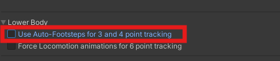

:::warning
3、4点トラッキング専用
:::

アバターのAvatar DescriptorにUse Auto-Footstepsという設定を無効にすると解決されます。

##### **アバターの表情がおかしくなる**

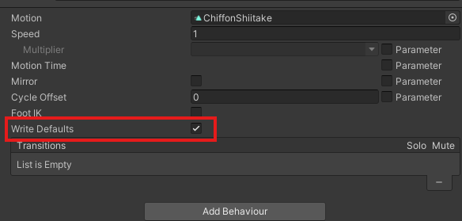

今のバージョンでは、FXレイヤーでWrite Defaultオンとオフを混ぜると発生するバグです。もしアバター本体のFXがオンであればすべてのアニメーションのWrite Defaultをオンにし、オフであれば全部オフにしたほうが良いです。ただし、デフォルトがオンの場合Write Defaultをそのまま切ると正しく動作しませんので、別ガイドに従って操作してください。

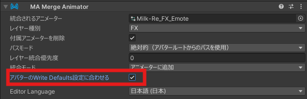

MAギミック、新衣装などを入れたあとに発生した場合では、ギミック、衣装のMA Merge Animatorの「アバターのWrite Default設定にあわせる」をチェック入れると修正されます。（ただし、一部のツールが動かなくなる場合があります）

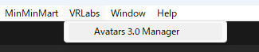

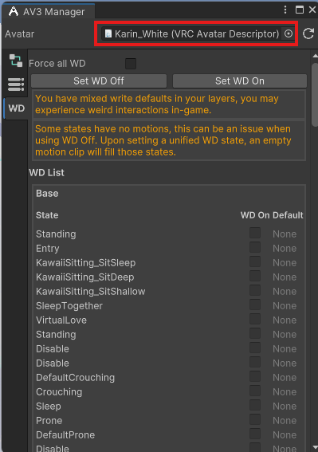

ちなみにWrite Defaultsを確認するには便利なツールがあります。VCCでAvatar3Managerというツールをプロジェクトに導入し、アバターを上の欄にDrag&DropするとWrite Defaultsがオフなのか確認できます。同じAnimator Controller（例えばFX）のWrite Defaultsが全部同じにすると直ります。

> Av3Managerは他のAnimator ControllerのWrite DefaultsがFXに違っても警告が出ますがFXの中で全部同じにすれば十分です。

##### **MMDワールドで表情が出ない**

:::tip
自作FX（コンボジェスチャーなど）をお使いでない場合ではFaceEmoがおすすめです。
:::

シェープキーがない場合とWrite Defaultがオフである場合、Write Defaultが混ぜている場合があります。

**シェープキーがない場合**では、Blenderで追加するか、ツールで追加するのが一般的です。
    
おすすめのツール[MMD表情設定ツール](https://booth.pm/ja/items/3696116)

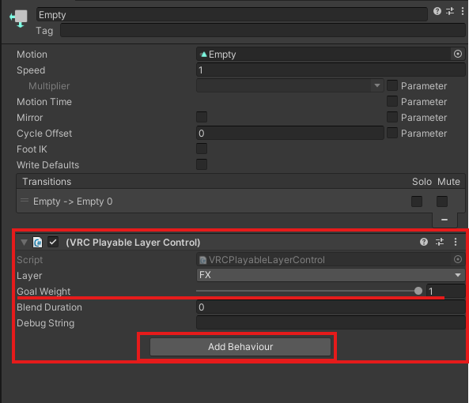

> この方法はToggleに関する基礎知識が必要です

**Write Defaultがオフ**の場合では、FXレイヤーにFX_OFFのレイヤーをWeightが0のままで追加し、Defaultsの下に置きます。中に空きのアニメーション2つを入れ、そのアニメーションにVRC Playable Layer Controlを入れます。コンポーネントのLayerをFXにし、オレンジ色のアニメーション（デフォルト）でのGoal Weightを1に、もう一つを0にします。接続してToggleを作ったら、そのToggleをオンにすればMMDで表情が出るようになります。ただし、このレイヤーはFXを無効にするため、有効にしている間ではジェスチャーで表情が出なくなります。

ただし、SceneでAvatarの下の衣装が全部オンにしている場合などではカオスな状況になりますので、この方法を使う場合アップロード時では必ずMMDのときに不要なオブジェクト（**ボーンとPBを含め**）すべてオフにしてください。（MAをご利用の場合、ボーンをオンのままにしてください。
 

**Write Defaultが混ぜている場合**では、上の [アバターの表情がおかしくなる](#アバターの表情がおかしくなる) にご参照ください。